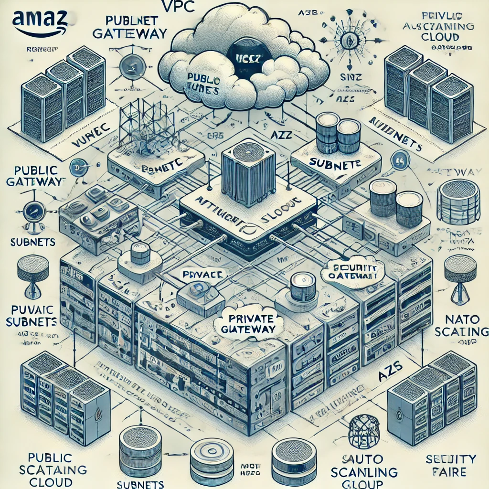

# Network Stack on AWS

A production-ready AWS network infrastructure built with **Terraform**, using official community modules. This project provisions a fully layered VPC with public and private subnets across multiple Availability Zones, NAT gateway for secure private-subnet egress, and an Auto Scaling Group of EC2 instances — all driven by clean, variable-first configuration.

---

## Architecture



```
                     ┌────────────────────────────────────────────┐
                     │                 AWS Region                  │
                     │                                             │
                     │  ┌──────────────── VPC ─────────────────┐  │
                     │  │                                       │  │
  Internet ─────────────►  Internet Gateway                    │  │
                     │  │         │                             │  │
                     │  │  ┌──────┴──────┐   ┌─────────────┐   │  │
                     │  │  │  Public     │   │  Public     │   │  │
                     │  │  │  Subnet AZ1 │   │  Subnet AZ2 │   │  │
                     │  │  └──────┬──────┘   └──────┬──────┘   │  │
                     │  │         │  NAT GW          │          │  │
                     │  │  ┌──────▼──────┐   ┌──────▼──────┐   │  │
                     │  │  │  Private    │   │  Private    │   │  │
                     │  │  │  Subnet AZ1 │   │  Subnet AZ2 │   │  │
                     │  │  └─────────────┘   └─────────────┘   │  │
                     │  │                                       │  │
                     │  │  Auto Scaling Group                   │  │
                     │  │  ├── EC2 instances (min/max/desired)  │  │
                     │  │  └── Security Group (HTTP + egress)   │  │
                     │  └───────────────────────────────────────┘  │
                     └────────────────────────────────────────────┘
```

---

## Features

- **Multi-AZ VPC** — Public and private subnets distributed across configurable Availability Zones for high availability
- **Internet Gateway** — Outbound internet access for public subnet resources
- **NAT Gateway** — One-way internet access from private subnets; optional `single_nat_gateway` mode reduces cost
- **Auto Scaling Group** — EC2 fleet with configurable min, max, and desired capacity; always uses the latest Amazon Linux AMI
- **Security Groups** — Fully configurable ingress and egress rule sets via named rule variables
- **EC2 Key Pair** — SSH key pair provisioned and managed through Terraform
- **Module-driven** — Built on `terraform-aws-modules/vpc` and `terraform-aws-modules/autoscaling` for reliability and community best practices

---

## Tech Stack

| Layer | Technology |
|---|---|
| Infrastructure as Code | Terraform >= 1.9.0 |
| Networking | `terraform-aws-modules/vpc/aws` (~> 5.13) |
| Compute | `terraform-aws-modules/autoscaling/aws` (~> 8.0) |
| Cloud Provider | AWS (`hashicorp/aws` ~> 5.66) |

---

## Project Structure

```
network-stack-on-aws/
├── vpc.tf              # VPC, subnets, internet gateway, NAT gateway
├── asg.tf              # Auto Scaling Group and launch template
├── sg.tf               # Security group configuration
├── keypair.tf          # EC2 SSH key pair
├── data.tf             # AMI and availability zone data sources
├── locals.tf           # Computed local values and resource tags
├── variables.tf        # All input variable declarations
├── terraform.tfvars    # Deployment variable values
├── output.tf           # Stack outputs
├── providers.tf        # AWS provider configuration
├── versions.tf         # Terraform and provider version constraints
└── images/
    └── architecture_diagram.webp
```

---

## Configuration

All variables are declared in `variables.tf` and set via `terraform.tfvars`.

**VPC Variables**

| Variable | Description | Default |
|---|---|---|
| `aws_region` | AWS deployment region | `ap-southeast-1` |
| `vpc_cidr` | VPC CIDR block | — |
| `vpc_public_subnets` | List of public subnet CIDR blocks | — |
| `vpc_private_subnets` | List of private subnet CIDR blocks | — |
| `availability_zones` | Target Availability Zones | `["ap-southeast-1a"]` |
| `enable_nat_gateway` | Provision a NAT gateway | `false` |
| `single_nat_gateway` | Use one shared NAT gateway to reduce cost | `false` |
| `enable_dns_hostnames` | Enable DNS hostnames in the VPC | `false` |
| `enable_dns_support` | Enable DNS resolution in the VPC | `false` |

**Auto Scaling Group Variables**

| Variable | Description | Default |
|---|---|---|
| `instance_type` | EC2 instance type (e.g. `t3.micro`) | — |
| `min_size_asg` | Minimum instance count | `0` |
| `max_size_asg` | Maximum instance count | `0` |
| `desired_capacity_asg` | Desired running instance count | `0` |
| `health_check_type` | Health check type: `EC2` or `ELB` | — |

**Security Group Variables**

| Variable | Description | Default |
|---|---|---|
| `sg_description` | Security group description | — |
| `sg_ingress_rules` | Named ingress rule list | `["http-80-tcp"]` |
| `sg_ingress_cidr_block` | Allowed source CIDR blocks | `["0.0.0.0/0"]` |
| `sg_egress_rules` | Named egress rule list | `["all-all"]` |
| `sg_egress_cidr_block` | Allowed destination CIDR blocks | `["0.0.0.0/0"]` |

---

## Prerequisites

- [Terraform](https://developer.hashicorp.com/terraform/downloads) >= 1.9.0
- [AWS CLI](https://aws.amazon.com/cli/) configured with appropriate credentials
- AWS IAM permissions to create VPCs, EC2 instances, Auto Scaling Groups, and NAT Gateways

---

## Deployment

```bash
# Clone the repository
git clone <repo-url>
cd network-stack-on-aws

# Initialize Terraform and download providers/modules
terraform init

# Validate configuration
terraform validate

# Preview resources to be created
terraform plan

# Deploy the infrastructure
terraform apply
```

---

## Outputs

| Output | Description |
|---|---|
| `name` | Name of the network stack |
| `aws_account_id` | AWS account ID of the deployment |
| `vpc_id` | ID of the created VPC |
| `public_subnets` | List of public subnet IDs |
| `private_subnets` | List of private subnet IDs |
| `ec2_security_group_name` | Name of the EC2 security group |
| `autoscaling_group_id` | ID of the Auto Scaling Group |
| `private_key_pem` | SSH private key for EC2 access *(sensitive)* |

---

## Cleanup

```bash
terraform destroy
```

> Confirm with `yes` when prompted. This permanently deletes all provisioned resources including the VPC, NAT gateway, and Auto Scaling Group.
